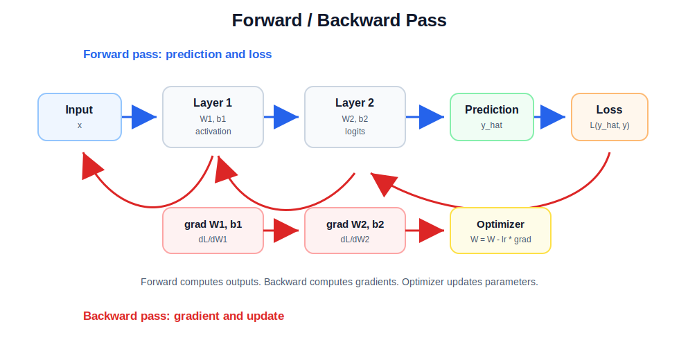

# Forward / Backward

순전파와 역전파는 모델 학습의 기본 흐름입니다.

```text
input -> forward -> prediction -> loss -> backward -> gradient -> update
```



## 왜 하는가

모델 학습은 크게 두 가지 질문을 반복해서 푸는 과정입니다.

1. 현재 파라미터로 예측하면 얼마나 틀리는가?
2. loss를 줄이려면 각 파라미터를 어느 방향으로 바꿔야 하는가?

순전파는 첫 번째 질문에 답합니다. 입력을 모델에 통과시켜 예측값과 loss를 계산합니다.

역전파는 두 번째 질문에 답합니다. loss에서 시작해 각 파라미터가 loss에 얼마나 영향을 줬는지 gradient를 계산합니다.

## Forward Pass

순전파는 입력 데이터를 모델에 넣어 예측값을 계산하는 과정입니다.

```python
outputs = model(inputs)
loss = criterion(outputs, targets)
```

이 단계에서는 각 layer가 입력을 받아 출력을 만들고, 마지막에 loss를 계산합니다.

```text
x -> layer1 -> activation -> layer2 -> prediction -> loss
```

순전파 결과로 얻는 것:

- prediction
- loss
- backward 계산에 필요한 중간 activation
- 연산 그래프

## Backward Pass

역전파는 loss에서 시작해 각 파라미터가 loss에 얼마나 영향을 줬는지 gradient를 계산하는 과정입니다.

```python
loss.backward()
```

PyTorch는 forward 과정에서 연산 그래프를 저장해 두었다가 `backward()`가 호출되면 chain rule로 gradient를 계산합니다.

```text
loss -> dL/dW2 -> dL/dW1 -> optimizer update
```

역전파 결과로 얻는 것:

- 각 파라미터의 `.grad`
- weight를 업데이트할 방향
- layer별 학습 신호

## Chain Rule 관점

모델은 여러 함수가 이어진 형태입니다.

```text
y = f3(f2(f1(x)))
```

loss가 마지막 출력에 대해 계산되므로, 앞쪽 파라미터의 영향은 chain rule로 연결해서 구합니다.

```text
dL/dW1 = dL/dy * dy/df2 * df2/df1 * df1/dW1
```

이것이 역전파가 뒤에서 앞으로 gradient를 전달하는 이유입니다.

## 전체 학습 루프

```python
for inputs, targets in dataloader:
    optimizer.zero_grad()

    outputs = model(inputs)          # forward
    loss = criterion(outputs, targets)

    loss.backward()                  # backward
    optimizer.step()                 # update
```

각 줄의 역할:

- `optimizer.zero_grad()`: 이전 step의 gradient를 비웁니다.
- `model(inputs)`: 순전파로 예측값을 만듭니다.
- `criterion(outputs, targets)`: loss를 계산합니다.
- `loss.backward()`: 역전파로 gradient를 계산합니다.
- `optimizer.step()`: gradient를 이용해 파라미터를 업데이트합니다.

## Evaluation에서는 왜 backward를 안 하나

평가 단계에서는 모델을 업데이트하지 않습니다. 예측 성능만 확인하면 되므로 gradient 계산이 필요 없습니다.

```python
model.eval()

with torch.no_grad():
    outputs = model(inputs)
```

`torch.no_grad()`를 쓰면:

- 연산 그래프를 저장하지 않습니다.
- 메모리를 덜 씁니다.
- 추론 속도가 빨라질 수 있습니다.

## 자주 하는 실수

- `optimizer.zero_grad()`를 빼먹어 gradient가 계속 누적됨
- `loss.backward()` 전에 loss가 scalar인지 확인하지 않음
- evaluation 중에도 gradient를 계산해 메모리를 낭비함
- `model.train()`과 `model.eval()` 전환을 빼먹음

## 면접 포인트

- Forward는 예측과 loss를 계산하는 과정입니다.
- Backward는 loss를 줄이기 위한 gradient를 계산하는 과정입니다.
- Optimizer는 gradient를 이용해 실제 파라미터를 업데이트합니다.
- PyTorch의 `backward()`는 forward 때 만들어진 연산 그래프를 따라 chain rule을 적용합니다.
