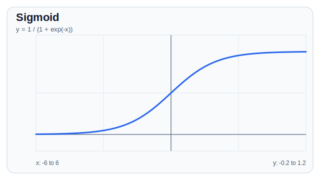
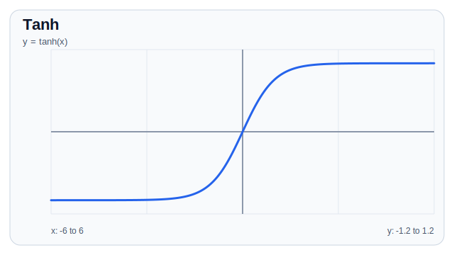
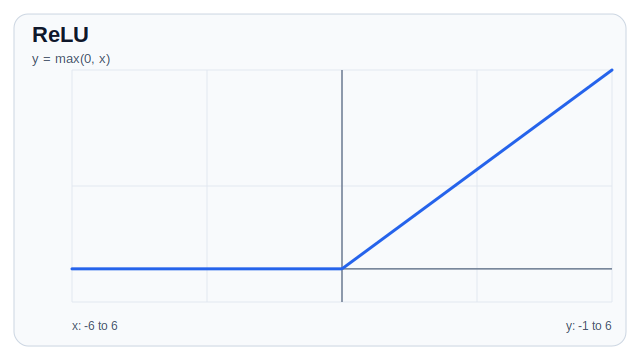
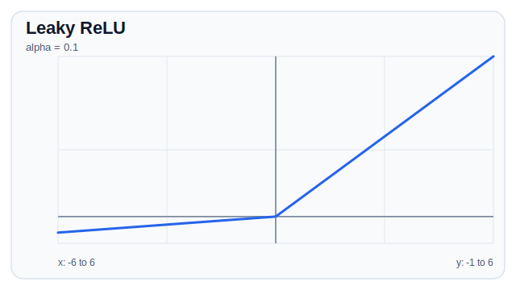
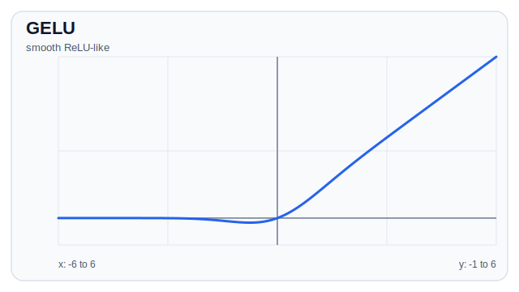
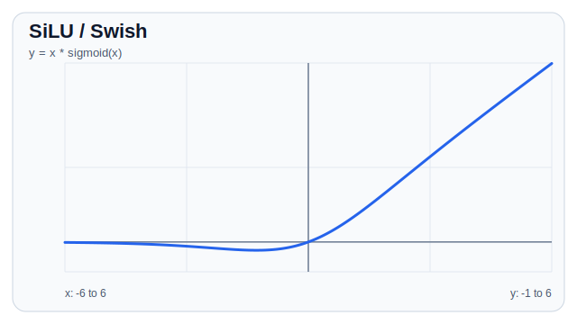
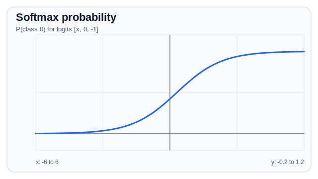

# Activation

Activation function은 신경망에 비선형성을 넣는 함수입니다. 여러 개의 linear layer를 쌓아도 activation이 없다면 전체 모델은 결국 하나의 linear transformation과 거의 같아집니다.

```text
Linear -> Activation -> Linear -> Activation -> Output
```

## 왜 필요한가

선형 변환만 있으면 모델은 복잡한 패턴을 표현하기 어렵습니다.

```text
y = W2(W1x + b1) + b2
  = (W2W1)x + (W2b1 + b2)
```

즉, linear layer를 여러 번 쌓아도 하나의 linear layer로 합쳐질 수 있습니다. Activation은 중간에 비선형 변환을 넣어 decision boundary를 더 복잡하게 만들 수 있게 합니다.

## Sigmoid

Sigmoid는 입력을 0과 1 사이 값으로 압축합니다.

$$
\sigma(x) = \frac{1}{1 + e^{-x}}
$$



```python
import torch
import torch.nn as nn

x = torch.tensor([-2.0, 0.0, 2.0])
activation = nn.Sigmoid()

y = activation(x)
print(y)
```

주로 이진 분류의 확률 해석에 사용됩니다. 다만 입력의 절댓값이 커지면 gradient가 매우 작아져 vanishing gradient 문제가 생길 수 있습니다.

## Tanh

Tanh는 입력을 -1과 1 사이 값으로 압축합니다.

$$
\tanh(x) = \frac{e^x - e^{-x}}{e^x + e^{-x}}
$$



```python
activation = nn.Tanh()
y = activation(x)
```

Sigmoid보다 출력이 0을 중심으로 대칭이라 RNN 계열에서 자주 사용되었습니다. 하지만 saturation 구간에서는 역시 gradient가 작아질 수 있습니다.

## ReLU

ReLU는 음수는 0으로 만들고, 양수는 그대로 통과시킵니다.

$$
\text{ReLU}(x) = \max(0, x)
$$



```python
activation = nn.ReLU()
y = activation(x)
```

장점:

- 계산이 빠릅니다.
- 양수 구간에서 gradient가 잘 흐릅니다.
- CNN, MLP에서 기본 선택지로 많이 쓰입니다.

주의할 점:

- 입력이 계속 음수로 들어오면 출력이 0이 되고 gradient도 0이 될 수 있습니다.
- 이를 dying ReLU 문제라고 부릅니다.

## Leaky ReLU

Leaky ReLU는 음수 구간도 아주 작은 기울기로 통과시킵니다.

$$
\text{LeakyReLU}(x) =
\begin{cases}
x & x > 0 \\
\alpha x & x \le 0
\end{cases}
$$



```python
activation = nn.LeakyReLU(negative_slope=0.01)
y = activation(x)
```

ReLU의 dying ReLU 문제를 완화할 수 있습니다.

## GELU

GELU는 입력값을 확률적으로 부드럽게 통과시키는 형태의 activation입니다. Transformer, BERT, GPT 계열에서 자주 등장합니다.

$$
\text{GELU}(x) = x \Phi(x)
$$

여기서 \(\Phi(x)\)는 표준정규분포의 누적분포함수입니다.

자주 쓰는 근사식은 다음과 같습니다.

$$
\text{GELU}(x) \approx 0.5x \left(1 + \tanh\left(\sqrt{\frac{2}{\pi}}(x + 0.044715x^3)\right)\right)
$$



```python
activation = nn.GELU()
y = activation(x)
```

ReLU보다 부드럽게 동작하며, 큰 Transformer 모델의 MLP block에서 많이 사용됩니다.

## SiLU / Swish

SiLU는 입력에 sigmoid gate를 곱한 형태입니다.

$$
\text{SiLU}(x) = x \cdot \sigma(x)
$$



```python
activation = nn.SiLU()
y = activation(x)
```

Llama 계열의 MLP에서는 SiLU 기반의 gated MLP 구조가 자주 사용됩니다.

## Softmax

Softmax는 여러 logit을 확률 분포로 바꿉니다.

$$
\text{softmax}(x_i) = \frac{e^{x_i}}{\sum_j e^{x_j}}
$$



Softmax는 입력 하나를 출력 하나로 바꾸는 스칼라 함수가 아니라 여러 logit을 확률 분포로 바꾸는 vector function입니다. 위 그래프에서는 비교를 위해 3-class logit `[x, 0, -1]`에서 첫 번째 class의 softmax 확률이 `x`에 따라 어떻게 변하는지 그렸습니다.

```python
logits = torch.tensor([[2.0, 0.5, -1.0]])
probs = torch.softmax(logits, dim=-1)

print(probs)
print(probs.sum(dim=-1))
```

분류 문제에서 각 클래스 확률을 볼 때 사용합니다. 다만 PyTorch의 `nn.CrossEntropyLoss`는 내부에서 `log_softmax`를 처리하므로, 학습 loss에 넣기 전에는 softmax를 직접 적용하지 않는 것이 일반적입니다.

## PyTorch MLP 예시

```python
import torch
import torch.nn as nn

class MLP(nn.Module):
    def __init__(self, input_dim, hidden_dim, output_dim):
        super().__init__()
        self.net = nn.Sequential(
            nn.Linear(input_dim, hidden_dim),
            nn.ReLU(),
            nn.Linear(hidden_dim, hidden_dim),
            nn.GELU(),
            nn.Linear(hidden_dim, output_dim),
        )

    def forward(self, x):
        return self.net(x)

model = MLP(input_dim=10, hidden_dim=32, output_dim=3)
x = torch.randn(4, 10)
logits = model(x)

print(logits.shape)  # [4, 3]
```

## 선택 기준

| Activation | 출력 범위 | 주 사용처 | 특징 |
|---|---|---|---|
| Sigmoid | 0 ~ 1 | 이진 확률 해석 | saturation에 취약 |
| Tanh | -1 ~ 1 | RNN, 작은 네트워크 | 0 중심 출력 |
| ReLU | 0 ~ inf | CNN, MLP | 빠르고 단순 |
| Leaky ReLU | -inf ~ inf | ReLU 대안 | dying ReLU 완화 |
| GELU | -inf ~ inf | Transformer | 부드러운 gating |
| SiLU | -inf ~ inf | LLM MLP | sigmoid gate 형태 |
| Softmax | 합이 1 | 다중 클래스 확률 | logit을 확률 분포로 변환 |

## 자주 하는 실수

- `CrossEntropyLoss` 전에 softmax를 적용함
- `BCEWithLogitsLoss` 전에 sigmoid를 적용함
- hidden layer에서 sigmoid를 과하게 사용해 gradient가 사라짐
- output layer activation과 loss function의 조합을 맞추지 않음

일반적으로 hidden layer에는 ReLU, GELU, SiLU 계열을 많이 쓰고, output의 activation은 task와 loss function에 맞춰 결정합니다.
