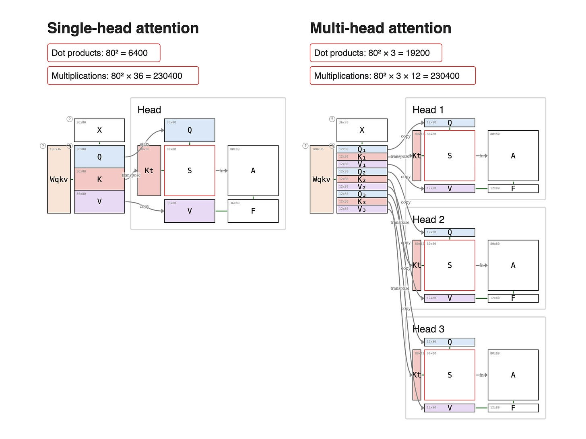

# Attention 기본

Attention은 각 token이 sequence 안의 다른 token을 얼마나 참고할지 계산하는 방법입니다.

## Q, K, V

- Query: 찾는 관점
- Key: 비교 대상의 특징
- Value: 실제로 가져올 정보

## Hidden Size, Head Dim, Num Attention Heads

`hidden_size`는 token 하나를 표현하는 vector 길이입니다. `num_attention_heads`는 attention을 몇 개 head로 나눌지 정합니다. `head_dim`은 head 하나가 담당하는 차원입니다.

```text
head_dim = hidden_size / num_attention_heads
```

예시:

```text
hidden_size = 4096
num_attention_heads = 32
head_dim = 128
```

## Multi-head Attention

여러 head가 서로 다른 관계 패턴을 병렬로 학습합니다.



출처: [Single vs Multi-Head Attention - AI by Hand](https://www.byhand.ai/p/library-models-attention-single-vs-multi-head)

## Grouped Query Attention

GQA는 query head 여러 개가 하나의 key/value head를 공유하도록 묶는 방식입니다. KV cache를 줄이면서 MQA보다 표현력을 유지하는 절충안입니다.

| 방식 | Query head | Key/Value head | 장점 | 단점 |
|---|---:|---:|---|---|
| MHA | 많음 | Query와 같음 | 표현력 좋음 | KV cache 큼 |
| MQA | 많음 | 1개 | KV cache 매우 작음 | 표현력 손실 가능 |
| GQA | 많음 | 몇 개 group | 메모리와 품질의 절충 | group 수 선택 필요 |
